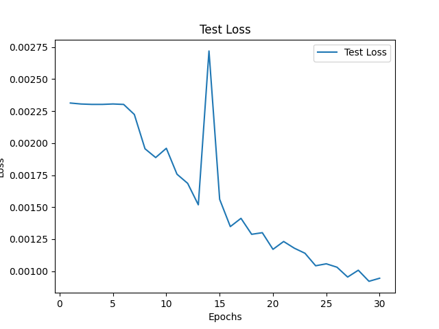

# 卷积神经网络实验报告
> 李潇逸    2111454


## 实验要求
* 掌握卷积的基本原理
* 学会使用PyTorch搭建简单的CNN实现Cifar10数据集分类
* 学会使用PyTorch搭建简单的ResNet实现Cifar10数据集分类
* 学会使用PyTorch搭建简单的DenseNet实现Cifar10数据集分类
* 学会使用PyTorch搭建简单的SE-ResNet实现Cifar10数据集分类


## 实验内容
* 老师提供的原始版本CNN网络结构（可用print(net)打印，复制文字或截图皆可）、在Cifar10验证集上的训练loss曲线、准确度曲线图
* 个人实现的ResNet网络结构在上述验证集上的训练loss曲线、准确度曲线图
* 个人实现的DenseNet网络结构在上述验证集上的训练loss曲线、准确度曲线图
* 个人实现的带有SE模块（Squeeze-and-Excitation Networks）的ResNet网络结构在上述验证集上的训练loss曲线、准确度曲线图
* 解释没有跳跃连接的卷积网络、ResNet、DenseNet、SE-ResNet在训练过程中有什么不同


## 实验过程

### CNN
#### 网络结构
```sh
Net(
  (conv1): Conv2d(3, 6, kernel_size=(5, 5), stride=(1, 1))
  (pool): MaxPool2d(kernel_size=2, stride=2, padding=0, dilation=1, ceil_mode=False)
  (conv2): Conv2d(6, 16, kernel_size=(5, 5), stride=(1, 1))
  (fc1): Linear(in_features=400, out_features=120, bias=True)
  (fc2): Linear(in_features=120, out_features=84, bias=True)
  (fc3): Linear(in_features=84, out_features=10, bias=True)
)
```
#### 结果曲线
每一轮训练的 loss 曲线

每一轮训练后网络在测试集上的 accuracy 曲线


### resnet
#### 简介
ResNet，全称Residual Network，是一种深度卷积神经网络（CNN），由何凯明等人于2015年提出。ResNet的核心创新在于引入了残差块（Residual Block），有效解决了随着网络层数增加而导致的梯度消失和梯度爆炸问题。传统的深度网络在加深时，训练效果反而可能变差，而ResNet通过添加快捷连接（Shortcut Connection）使得网络可以直接跨层传递信息。
一个残差块包括两个或三个卷积层，这些层之间的输入直接通过快捷连接添加到输出上。这样，即使某些卷积层未能学习到有用的特征，信息仍然可以沿着快捷路径传递，从而保持梯度的有效传播。ResNet的结构使得它能够构建非常深的网络，如ResNet50、ResNet101和ResNet152等，分别包含50层、101层和152层。
#### 网络结构
**ResNet-34**
```sh
ResNet(
  (conv1): Conv2d(3, 64, kernel_size=(7, 7), stride=(2, 2), padding=(3, 3), bias=False)
  (bn1): BatchNorm2d(64, eps=1e-05, momentum=0.1, affine=True, track_running_stats=True)
  (relu): ReLU(inplace=True)
  (maxpool): MaxPool2d(kernel_size=3, stride=2, padding=1, dilation=1, ceil_mode=False)
  (layer1): Sequential(
    (0): BasicBlock(
      (conv1): Conv2d(64, 64, kernel_size=(3, 3), stride=(1, 1), padding=(1, 1), bias=False)
      (bn1): BatchNorm2d(64, eps=1e-05, momentum=0.1, affine=True, track_running_stats=True)
      (conv2): Conv2d(64, 64, kernel_size=(3, 3), stride=(1, 1), padding=(1, 1), bias=False)
      (bn2): BatchNorm2d(64, eps=1e-05, momentum=0.1, affine=True, track_running_stats=True)
      (relu): ReLU(inplace=True)
    )
###### 中间层略 ######
  (layer4): Sequential(
    (0): BasicBlock(
      (conv1): Conv2d(256, 512, kernel_size=(3, 3), stride=(2, 2), padding=(1, 1), bias=False)
      (bn1): BatchNorm2d(512, eps=1e-05, momentum=0.1, affine=True, track_running_stats=True)
      (conv2): Conv2d(512, 512, kernel_size=(3, 3), stride=(1, 1), padding=(1, 1), bias=False)
      (bn2): BatchNorm2d(512, eps=1e-05, momentum=0.1, affine=True, track_running_stats=True)
      (relu): ReLU(inplace=True)
      (downsample): Sequential(
        (0): Conv2d(256, 512, kernel_size=(1, 1), stride=(2, 2), bias=False)
        (1): BatchNorm2d(512, eps=1e-05, momentum=0.1, affine=True, track_running_stats=True)
      )
    )
###### 中间层略 ######
  (avgpool): AdaptiveAvgPool2d(output_size=(1, 1))
  (fc): Linear(in_features=512, out_features=10, bias=True)
)
```
**ResNet-152**
```sh
ResNet(
  (conv1): Conv2d(3, 64, kernel_size=(7, 7), stride=(2, 2), padding=(3, 3), bias=False)
  (bn1): BatchNorm2d(64, eps=1e-05, momentum=0.1, affine=True, track_running_stats=True)
  (relu): ReLU(inplace=True)
  (maxpool): MaxPool2d(kernel_size=3, stride=2, padding=1, dilation=1, ceil_mode=False)
  (layer1): Sequential(
    (0): Bottleneck(
      (conv1): Conv2d(64, 64, kernel_size=(1, 1), stride=(1, 1), bias=False)
      (bn1): BatchNorm2d(64, eps=1e-05, momentum=0.1, affine=True, track_running_stats=True)
      (conv2): Conv2d(64, 64, kernel_size=(3, 3), stride=(1, 1), padding=(1, 1), bias=False)
      (bn2): BatchNorm2d(64, eps=1e-05, momentum=0.1, affine=True, track_running_stats=True)
      (conv3): Conv2d(64, 256, kernel_size=(1, 1), stride=(1, 1), bias=False)
      (bn3): BatchNorm2d(256, eps=1e-05, momentum=0.1, affine=True, track_running_stats=True)
      (relu): ReLU(inplace=True)
      (downsample): Sequential(
        (0): Conv2d(64, 256, kernel_size=(1, 1), stride=(1, 1), bias=False)
        (1): BatchNorm2d(256, eps=1e-05, momentum=0.1, affine=True, track_running_stats=True)
      )
    )
###### 中间层略 ######
  (layer4): Sequential(
    (0): Bottleneck(
      (conv1): Conv2d(1024, 512, kernel_size=(1, 1), stride=(1, 1), bias=False)
      (bn1): BatchNorm2d(512, eps=1e-05, momentum=0.1, affine=True, track_running_stats=True)
      (conv2): Conv2d(512, 512, kernel_size=(3, 3), stride=(2, 2), padding=(1, 1), bias=False)
      (bn2): BatchNorm2d(512, eps=1e-05, momentum=0.1, affine=True, track_running_stats=True)
      (conv3): Conv2d(512, 2048, kernel_size=(1, 1), stride=(1, 1), bias=False)
      (bn3): BatchNorm2d(2048, eps=1e-05, momentum=0.1, affine=True, track_running_stats=True)
      (relu): ReLU(inplace=True)
      (downsample): Sequential(
        (0): Conv2d(1024, 2048, kernel_size=(1, 1), stride=(2, 2), bias=False)
        (1): BatchNorm2d(2048, eps=1e-05, momentum=0.1, affine=True, track_running_stats=True)
      )
    )
###### 中间层略 ######
  (avgpool): AdaptiveAvgPool2d(output_size=(1, 1))
  (fc): Linear(in_features=2048, out_features=10, bias=True)
)
```
#### 训练结果
**ResNet34**
训练loss曲线

测试loss曲线和准确率曲线


**ResNet152**
训练loss曲线

测试loss曲线和准确率曲线


#### 分析
在训练时发现resnet由于层数更多、参数更多导致其训练速度稍慢，同时还发现只要重新开始冷启动，模型大小并不是最终结果优劣的判断标准，这是由于在开始时模型参数是随机生成的。尽管如此，较之CNN，resnet模型训练所能达到的准确率明显更好，且在训练过程中的loss曲线和准确率曲线都较为平缓，其训练结果更好。

### densenet
#### 简介
DenseNet，全称为Densely Connected Convolutional Networks，是一种用于图像分类和计算机视觉任务的深度学习模型。由Gao Huang等人在2016年提出，DenseNet的主要特点是通过直接连接每一层到其后面的所有层，极大地缓解了深度神经网络中的梯度消失问题。
在传统的卷积神经网络（如ResNet）中，层与层之间通常是顺序连接的。而DenseNet则引入了一种密集连接的机制，使得每一层的输出都直接传递给后续所有层。这种设计带来了几个显著的优势：
1. **高效的特征传递和复用**：DenseNet通过密集连接确保了梯度能够顺利地从后面的层传递到前面的层，从而有效解决了梯度消失问题。同时，特征在网络中得以多次复用，提高了模型的效率和准确率。
2. **参数效率**：由于每一层都接收来自之前所有层的特征，DenseNet在达到相同准确率的情况下需要更少的参数和计算资源。
3. **减轻过拟合**：通过特征的复用和更深层次的信息传递，DenseNet在小数据集上表现优异，具有较强的泛化能力。

DenseNet模型通常由多个Dense Block组成，每个Dense Block内部层层紧密连接，Block之间通过过渡层（Transition Layer）连接。这种结构设计使得DenseNet既能够保持高效的特征学习，又具有较低的参数复杂度和计算成本。
#### 网络结构
```sh
DenseNet(
  (conv1): Conv2d(3, 24, kernel_size=(7, 7), stride=(2, 2), padding=(3, 3), bias=False)
  (bn1): BatchNorm2d(24, eps=1e-05, momentum=0.1, affine=True, track_running_stats=True)
  (relu): ReLU(inplace=True)
  (pool1): MaxPool2d(kernel_size=3, stride=2, padding=1, dilation=1, ceil_mode=False)
  (blocks): ModuleList(
    (0): DenseBlock(
      (block): Sequential(
        (0): DenseLayer(
          (bn): BatchNorm2d(24, eps=1e-05, momentum=0.1, affine=True, track_running_stats=True)
          (relu): ReLU(inplace=True)
          (conv): Conv2d(24, 12, kernel_size=(3, 3), stride=(1, 1), padding=(1, 1), bias=False)
        )
        (1): DenseLayer(
          (bn): BatchNorm2d(36, eps=1e-05, momentum=0.1, affine=True, track_running_stats=True)
          (relu): ReLU(inplace=True)
          (conv): Conv2d(36, 12, kernel_size=(3, 3), stride=(1, 1), padding=(1, 1), bias=False)
        )
###### 中间层略 ######
  (bn2): BatchNorm2d(132, eps=1e-05, momentum=0.1, affine=True, track_running_stats=True)
  (fc): Linear(in_features=132, out_features=10, bias=True)
)
```
#### 训练结果
训练loss曲线

测试loss曲线和准确率曲线

#### 分析
可以发现，densenet开始训练时loss和accuracy都比resnet好，其最终结果更是能比resnet好5%左右。

### SE-resnet
#### 简介
SE-ResNet（Squeeze-and-Excitation ResNet）是对标准ResNet（Residual Network）的改进版本。它通过引入Squeeze-and-Excitation（SE）模块来增强卷积神经网络（CNN）的表现，特别是对特征表示的建模能力。SE模块通过自适应地重新校准特征图的通道维度，提高了网络的表现能力。
**SE模块的详细介绍**
SE模块包括两个主要操作：Squeeze和Excitation。
1. **Squeeze**:
    - 这个阶段将全局空间信息压缩成一个单一的特征向量。具体来说，给定一个输入特征图 \( U \)（尺寸为 \( H \times W \times C \)，其中 \( H \) 和 \( W \) 是空间维度，\( C \) 是通道数），SE模块首先进行全局平均池化（Global Average Pooling），得到每个通道上的平均值。结果是一个长度为 \( C \) 的向量 \( z \)。
    - 数学表示为：\[ z_c = \frac{1}{H \times W} \sum_{i=1}^{H} \sum_{j=1}^{W} U_{c}(i,j) \]
2. **Excitation**:
    - 这个阶段通过一个全连接层（FC）学习每个通道的重要性。具体来说，SE模块使用两个全连接层和一个非线性激活函数（通常是ReLU和Sigmoid），生成一个与输入特征图的通道数相同的权重向量 \( s \)。这些权重代表了每个通道的重要性。
    - 数学表示为：\[ s = \sigma(W_2 \delta(W_1 z)) \]
    - 其中，\( W_1 \) 和 \( W_2 \) 是两个全连接层的权重矩阵，\( \delta \) 是ReLU激活函数，\( \sigma \) 是Sigmoid激活函数。
3. **重新加权（Reweighting）**:
    - 通过乘法操作将这些权重应用到原始特征图的每个通道上。具体来说，输入特征图 \( U \) 的每个通道都与对应的权重 \( s_c \) 相乘，得到重新加权后的特征图 \( \tilde{U} \)。
    - 数学表示为：\[ \tilde{U}_{c}(i,j) = s_c \cdot U_{c}(i,j) \]

**SE-ResNet的架构**
SE-ResNet的架构是在标准ResNet的基础上，将SE模块嵌入到每个残差块（Residual Block）中。具体步骤如下：
1. **标准ResNet残差块**：
    - 包含两个卷积层，每个卷积层后跟着一个批量归一化（Batch Normalization）和ReLU激活函数。残差连接将输入直接添加到输出。
2. **SE模块嵌入**：
    - 在每个残差块的卷积操作之后和加上残差连接之前，插入SE模块。

**SE-ResNet的优点**
1. **提升性能**：SE模块能够自适应地强调重要特征，抑制无关特征，提高了模型的分类准确性。
2. **轻量级**：SE模块的参数相对较少，增加的计算开销很小。
3. **灵活性**：SE模块可以很容易地集成到现有的各种网络架构中，不仅限于ResNet。

#### 网络结构
```sh
ResNet(
  (conv1): Conv2d(3, 64, kernel_size=(7, 7), stride=(2, 2), padding=(3, 3), bias=False)
  (bn1): BatchNorm2d(64, eps=1e-05, momentum=0.1, affine=True, track_running_stats=True)
  (relu): ReLU(inplace=True)
  (maxpool): MaxPool2d(kernel_size=3, stride=2, padding=1, dilation=1, ceil_mode=False)
  (layer1): Sequential(
    (0): BasicBlock(
      (conv1): Conv2d(64, 64, kernel_size=(3, 3), stride=(1, 1), padding=(1, 1), bias=False)
      (bn1): BatchNorm2d(64, eps=1e-05, momentum=0.1, affine=True, track_running_stats=True)
      (conv2): Conv2d(64, 64, kernel_size=(3, 3), stride=(1, 1), padding=(1, 1), bias=False)
      (bn2): BatchNorm2d(64, eps=1e-05, momentum=0.1, affine=True, track_running_stats=True)
      (relu): ReLU(inplace=True)
      (se): SEModule(
        (avg_pool): AdaptiveAvgPool2d(output_size=1)
        (fc): Sequential(
          (0): Linear(in_features=64, out_features=4, bias=False)
          (1): ReLU(inplace=True)
          (2): Linear(in_features=4, out_features=64, bias=False)
          (3): Sigmoid()
        )
      )
    )
    (1): BasicBlock(
      (conv1): Conv2d(64, 64, kernel_size=(3, 3), stride=(1, 1), padding=(1, 1), bias=False)
      (bn1): BatchNorm2d(64, eps=1e-05, momentum=0.1, affine=True, track_running_stats=True)
      (conv2): Conv2d(64, 64, kernel_size=(3, 3), stride=(1, 1), padding=(1, 1), bias=False)
      (bn2): BatchNorm2d(64, eps=1e-05, momentum=0.1, affine=True, track_running_stats=True)
      (relu): ReLU(inplace=True)
      (se): SEModule(
        (avg_pool): AdaptiveAvgPool2d(output_size=1)
        (fc): Sequential(
          (0): Linear(in_features=64, out_features=4, bias=False)
          (1): ReLU(inplace=True)
          (2): Linear(in_features=4, out_features=64, bias=False)
          (3): Sigmoid()
        )
      )
    )
###### 中间层略 ######
  (avgpool): AdaptiveAvgPool2d(output_size=(1, 1))
  (fc): Linear(in_features=512, out_features=10, bias=True)
)
```
可以看到在一个basic块之后都会接一个SEModule
#### 训练结果
训练loss曲线

测试loss曲线和准确率曲线


#### 分析
可以发现，增加了SE模块的resnet其训练过程依旧平缓，同时，训练结果较之单纯的resnet大大提升，可以证明SE模块在深度学习过程中的重要作用。


## 总结
在训练过程中，没有跳跃连接的卷积网络、ResNet、DenseNet 和 SE-ResNet 有显著的不同。这些网络架构在设计上的差异会影响到它们的训练动态、收敛速度和性能表现。

### 没有跳跃连接的卷积网络
**没有跳跃连接的卷积网络**（也称为普通卷积网络）是传统的深度卷积神经网络架构。这种网络中，每一层的输出直接作为下一层的输入，没有任何跳跃连接。其特点和训练过程中的挑战包括：
- **梯度消失和爆炸**：由于缺乏跳跃连接，梯度在反向传播过程中可能会逐层消失或爆炸，导致训练困难。
- **训练困难**：随着网络层数增加，训练变得越来越困难，网络可能难以收敛。
- **性能受限**：这种网络在处理复杂任务时可能表现不佳，因为深度增加并不总能带来性能提升。

### ResNet（Residual Networks）
**ResNet** 引入了残差块和跳跃连接（skip connections），大幅改善了深层网络的训练性能。其特点包括：
- **残差块**：通过直接将输入与输出相加，残差块能够有效缓解梯度消失问题。
- **加速收敛**：跳跃连接使得网络能够更快地收敛，提高训练效率。
- **深度增加**：由于跳跃连接的存在，ResNet 能够轻松训练非常深的网络（如 ResNet-101），在许多任务上表现出色。

### DenseNet（Densely Connected Networks）
**DenseNet** 引入了更加密集的连接方式，每一层都接收之前所有层的特征图作为输入。这种设计带来的特点包括：
- **特征复用**：每一层都可以利用之前所有层的特征，增强了特征复用和传播。
- **减少梯度消失**：密集连接使得梯度可以直接从后面层传递到前面层，进一步减缓梯度消失问题。
- **参数效率**：由于特征的高复用性，DenseNet 在相对较少的参数情况下也能达到很好的性能。

### SE-ResNet（Squeeze-and-Excitation ResNet）
**SE-ResNet** 结合了 Squeeze-and-Excitation（SE）模块和 ResNet 的残差结构，进一步增强了网络的特征表示能力。其特点包括：
- **SE模块**：通过“挤压”操作（squeeze）和“激励”操作（excitation），SE模块能够自适应地重新标定特征图的通道权重，提升网络的表示能力。
- **增强特征表示**：SE模块可以让网络更加关注重要的特征，提升模型的表现。
- **训练稳定性**：SE模块与残差连接的结合，既保留了 ResNet 的稳定训练特点，又增强了模型的特征表达能力。

### 总结
- **没有跳跃连接的卷积网络**：训练困难，容易梯度消失或爆炸，深度增加效果有限。
- **ResNet**：引入残差块和跳跃连接，缓解梯度消失问题，提高训练效率，适合深层网络。
- **DenseNet**：每层密集连接，增强特征复用，减缓梯度消失，参数效率高。
- **SE-ResNet**：结合 SE 模块和残差连接，增强特征表示能力，提升模型表现和训练稳定性。