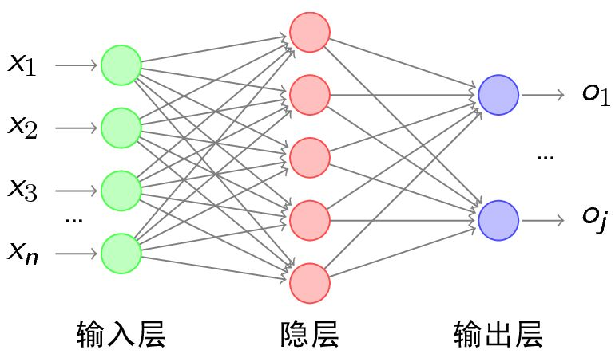
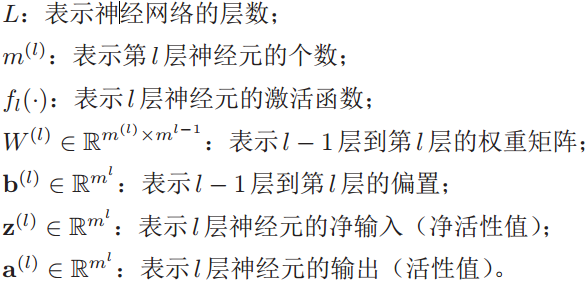
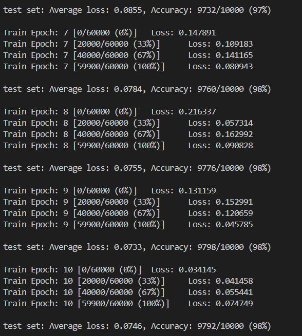
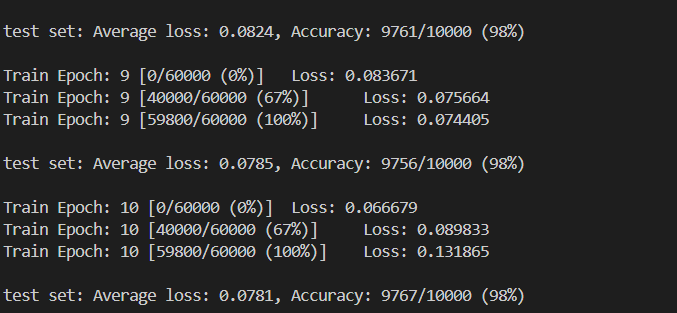
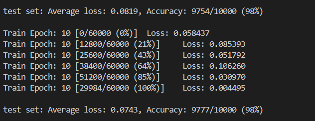
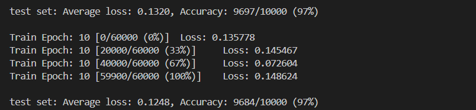
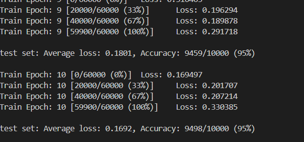
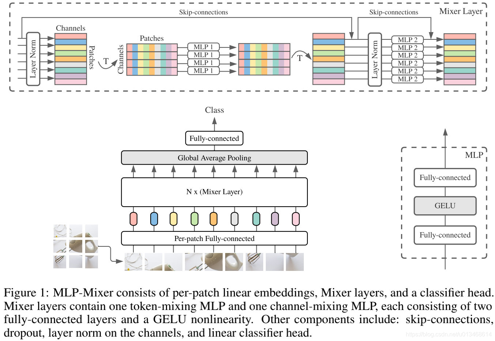
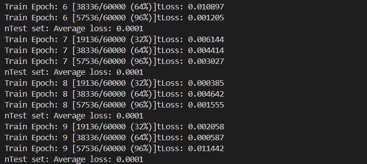

# 卷积神经网络实验报告
> 姓名：李潇逸     学号：2111454

## 实验要求
- 掌握前馈神经网络（FFN）的基本原理
- 学会使用PyTorch搭建简单的FFN实现MNIST数据集分类
- 掌握如何改进网络结构、调试参数以提升网络识别性能


## 前馈神经网络（FFN）概述
前馈神经网络中，把每个神经元按接收信息的先后分为不同的组，每一组可以看做是一个神经层。每一层中的神经元接收前一层神经元的输出，并输出到下一层神经元。整个网络中的信息是朝着一个方向传播的，没有反向的信息传播，可以用一个有向无环图来表示。

前馈神经网络包括全连接前馈神经网络和卷积神经网络。
前馈神经网络可以看做是一个函数，通过简单非线性函数的多次复合，实现输入空间到输出空间的复杂映射。

### 前向传播
用下面的记号来描述一个前馈神经网络：

前馈神经网络通过下面公式进行信息传播：
$$z^{(l)} = W^{(l)} · a^{(l-1)} + b^{(l)}$$
$$a^{(l)} = f_{l}(z^{(l)})$$

### 梯度下降
交叉熵损失函数，对于样本(x,y)，其损失函数为：
$${\cal L}(y,\hat{y}) = - y^T \log \hat{y}$$
给定训练集D={(x(1), y(1)),(x(2), y(2)),...,(x(N), y(N))}，将每个样本x(n)输入给前馈神经网络，得到神经网络的输出后，其在训练集D上的结构化风险函数为：
$$ {\cal R} (W, b) = { 1 \over N } \sum_{n=1}^{N} {\cal L} (y^{(n)}, \hat{y}^{(n)}) + { 1 \over 2 } \lambda || W ||_F^2 $$
$$ = { 1 \over N } \sum_{n=1}^{N} {\cal L} (y^{(n)}, \hat{y}^{(n)}) + { 1 \over 2 } \lambda || W ||_F^2 $$
其中W和b分别表示网络中所有的权重矩阵和偏置向量。$|| W || _ { F } ^ { 2 }$是正则化项，公式为：
$$|| W || _ { F } ^ { 2 } = \sum _ { l = 1 } ^ { L } \sum _ { i = 1 } ^ { m ^ { ( l ) } } \sum _ { j = 1 } ^ { m ^ { ( l - 1 ) } } ( W _ { i j } ^ { ( l ) } ) ^ { 2 }$$
然后用梯度下降法来进行学习。在梯度下降法的每次迭代中，第l层的参数W(l)和b(l)的参数更新方式为：
$$ \begin{array}{rcl} W^{(l)} &\leftarrow& W^{(l)} - \alpha { \partial {\cal R} (W,b) \over \partial W^{(l)} }, \\ &=& W^{(l)} - \alpha \left({ 1 \over N } \sum_{n=1}^{N} ({ \partial {\cal L} (y^{(n)}, \hat{y}^{(n)}) \over \partial W^{(l)}}) + \lambda W^{(l)} \right),\\[6pt] b^{(l)} &\leftarrow& b^{(l)} - \alpha { \partial {\cal R} (W,b) \over \partial b^{(l)} }, \\ &=& b^{(l)} - \alpha \left({ 1 \over N } \sum_{n=1}^{N} ({ \partial {\cal L} (y^{(n)}, \hat{y}^{(n)}) \over \partial b^{(l)}}) \right), \end{array} $$

### 梯度消失和梯度爆炸
#### 梯度消失
梯度消失（Vanishing Gradient Problem，或称梯度弥散）的意思是，在误差反向传播的过程中，误差经过每一层传递都会不断衰减，当网络层数很深时，神经元上的梯度也会不断衰减，导致前面的隐含层神经元的学习速度慢于后面隐含层上的神经元。
#### 梯度爆炸
梯度爆炸（Exploding Gradient Problem），也就是前面层中神经元的梯度变得非常大。与梯度消失不太一样的是，梯度爆炸通常产生于过大的权重W。


## 实验过程

### MLP
#### 数据读取和处理
```py
# Device configuration 
device = torch.device('cuda' if torch.cuda.is_available() else 'cpu') # select cuda or cpu
print('Using PyTorch version:', torch.__version__, ' Device:', device)
# Hyper-parameters 

batch_size = 100
learning_rate = 0.001

# MNIST dataset
train_dataset = datasets.MNIST(
    root='MLP/data', # url of the data
    train=True,
    transform = transforms.ToTensor(), 
    download=True
)
test_dataset = datasets.MNIST(
    root='MLP/data',
    train=False, # is not train data
    transform=transforms.ToTensor() # work on imput and change the dimension
)

# Data loader
train_loader = torch.utils.data.DataLoader(
    dataset=train_dataset,
    batch_size=batch_size,
    shuffle=True # shuffle the data to be random
)

test_loader = torch.utils.data.DataLoader(
    dataset=test_dataset,
    batch_size=batch_size,
    shuffle=False
)
```
其中，`batch_size` 是指一次训练的数据量，大小影响了训练速度和精度。一般来说，此数值越大训练速度越慢，但梯度更精准；越小梯度波动大，容易出现过拟合。
`learning_rate` 是指学习率，学习率越大，学习快，但易损失值爆炸且易振荡；学习率越小，学习速度慢，但易过拟合且收敛速度慢。
#### 网络函数
```py
class MLPNet(nn.Module):
    def __init__(self):
        super(MLPNet, self).__init__()
        self.fc1 = nn.Linear(28*28,100) # from input layer to hidden layer
        self.fc1_drop = nn.Dropout(0.2)
        self.fc2 = nn.Linear(100,80) # from hidden layer to output layer
        self.fc2_drop = nn.Dropout(0.2)
        self.fc3 = nn.Linear(80, 10)
    def forward(self, x):# connect the layers to net
        out = x.view(-1, 28*28) # reshape the input data
        out = F.relu(self.fc1(x)) # relu activation function
        out = self.fc1_drop(out) # dropout
        out = F.relu(self.fc2(out))
        out = self.fc2_drop(out)
        return F.log_softmax(self.fc3(out), dim=1) # softmax activation function

model = MLPNet().to(device) # three layers of net
```
#### 训练函数
```py
def train(epoch):
    model.train()
    for batch_idx, (data, target) in enumerate(train_loader):
        data= data.reshape(-1, 28*28).to(device)
        target = target.to(device)
        optimizer.zero_grad()
        output = model(data)
        loss = criterion(output, target)
        loss.backward()
        optimizer.step()
        if batch_idx % 200 == 0:
            print('Train Epoch: {} [{}/{} ({:.0f}%)]\tLoss: {:.6f}'.format(
                epoch, batch_idx * len(data), len(train_loader.dataset),
                100. * batch_idx / len(train_loader), loss.data.item()))
    print('Train Epoch: {} [{}/{} ({:.0f}%)]\tLoss: {:.6f}'.format(
                epoch, batch_idx * len(data), len(train_loader.dataset),
                100. * batch_idx / len(train_loader), loss.data.item()))
def validate(loss_vector, accuracy_vector):
    model.eval()
    val_loss, correct = 0, 0
    for data, target in test_loader:
        data = data.reshape(-1, 28*28).to(device)
        target = target.to(device)
        output = model(data)
        val_loss += criterion(output, target).data.item()
        pred = output.data.max(1)[1] # get the index of the max log-probability
        correct += pred.eq(target.data).cpu().sum()

    val_loss /= len(test_loader)
    loss_vector.append(val_loss)

    accuracy = 100. * correct.to(torch.float32) / len(test_loader.dataset)
    accuracy_vector.append(accuracy)
    
    print('\ntest set: Average loss: {:.4f}, Accuracy: {}/{} ({:.0f}%)\n'.format(
        val_loss, correct, len(test_loader.dataset), accuracy))
```
每轮训练经历两全连接层。
#### 结果

#### 微调
`batch_size`
* 增大：可以发现Loss在反复横跳，最终Loss更大，准确率更低

* 减小：可以发现Loss虽然更低，但是在训练过程中Loss并不集中


`learning_rate`
* 增大：Loss下降快，但是容易过拟合，最终准确率也更低

* 减小：Loss平稳，但是下降很慢


`图片大小`
* 增大：获取信息更全面，但是训练慢，容易过拟合
* 减小：获取信息少，训练快，容易欠拟合

最终测试结果发现`batch_size = 64`、`learning_rate = 0.001`可以取得最佳结果。若是使用可变学习率进行实验效果无疑会更好。

### MLP-Mixer
#### 简介
MLP-Mixer是一种完全基于多层感知机（Multi-Layer Perceptron, MLP）构建的视觉模型，它是由Google Research Brain团队在2021年提出的，用于计算机视觉任务，尤其是图像分类。不同于传统的卷积神经网络（CNN）以及后来流行的基于自注意力机制的Vision Transformer（ViT），MLP-Mixer摒弃了局部感受野的卷积层和全局自注意力机制，转而仅使用MLP对输入特征进行处理。

MLP-Mixer模型的基本结构包括两个主要组件：
1. **Token Mixing Layers**：这一层负责跨通道（channel）混合局部信息。它首先将输入图像划分为一系列 patches（类似于ViT中的处理方式），然后对这些patches在通道维度上应用MLP，以实现不同通道特征之间的交互。

2. **Channel Mixing Layers**：这一层则负责在同一位置的所有patch之间进行全局混合。它通过将整个特征映射展平成一个一维向量后，再应用MLP进行混合，从而使得每个通道能够捕获全局上下文信息。

具体来说，MLP-Mixer的网络结构可以概括为：
- 输入图像经过patch划分，并通过线性嵌入层转换到预定义的维度。
- 这些patch被送入多个重复堆叠的Token Mixing和Channel Mixing层。
- 在模型的末端通常会添加一个全局平均池化层，随后是一个分类头（MLP层），用于生成最终的类别预测。

尽管其设计思路简洁且新颖，MLP-Mixer在ImageNet等基准数据集上取得的性能虽然接近当时的最新技术水平（SOTA），但并未显著超越CNN或Transformer架构。然而，它的出现进一步拓宽了研究者对深度学习模型架构可能性的理解，尤其是在探索不依赖于卷积和自注意力机制的情况下如何有效处理视觉数据。

Fig 1给出了MLP-Mixer的宏观建构示意图，它以一系列图像块的线性投影(其形状为patches x channels)作为输入。Mixer采用了两种类型的MLP层(注:这两种类型的层交替执行以促进两个维度见的信息交互)：
* channel-mixingMLP：用于不同通道前通讯，每个token独立处理，即采用每一行作为输入；
* token-mixingMLP：用于不同空域位置通讯，每个通道图例处理，即采用每一列作为输入。

#### 代码
```py
class PreNormResidual(nn.Module):
    def __init__(self, dim, fn):
        super().__init__()
        self.fn = fn
        self.norm = nn.LayerNorm(dim)

    def forward(self, x):
        return self.fn(self.norm(x)) + x

def FeedForward(dim, expansion_factor = 4, dropout = 0., dense = nn.Linear):
    return nn.Sequential(
        dense(dim, dim * expansion_factor),
        nn.GELU(),
        nn.Dropout(dropout),
        dense(dim * expansion_factor, dim),
        nn.Dropout(dropout)
    )

def MLPMixer(*, image_size, channels, patch_size, dim, depth, num_classes, expansion_factor = 4, dropout = 0.):
    assert (image_size % patch_size) == 0, 'image must be divisible by patch size'
    num_patches = (image_size // patch_size) ** 2
    chan_first, chan_last = partial(nn.Conv1d, kernel_size = 1), nn.Linear

    return nn.Sequential(
        Rearrange('b c (h p1) (w p2) -> b (h w) (p1 p2 c)', p1 = patch_size, p2 = patch_size),
        nn.Linear((patch_size ** 2) * channels, dim),
        *[nn.Sequential(
            PreNormResidual(dim, FeedForward(num_patches, expansion_factor, dropout, chan_first)),
            PreNormResidual(dim, FeedForward(dim, expansion_factor, dropout, chan_last))
        ) for _ in range(depth)],
        nn.LayerNorm(dim),
        Reduce('b n c -> b c', 'mean'),
        nn.Linear(dim, num_classes)
    )
```
`FeedForward` 是一般的 `MLP`。
`MLPMixer` 首先将图像分割为几个 `batch`，之后进行一般的 `MLP`。
#### 结果
