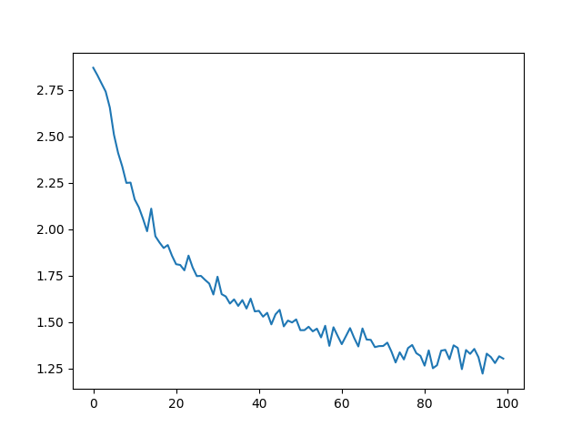
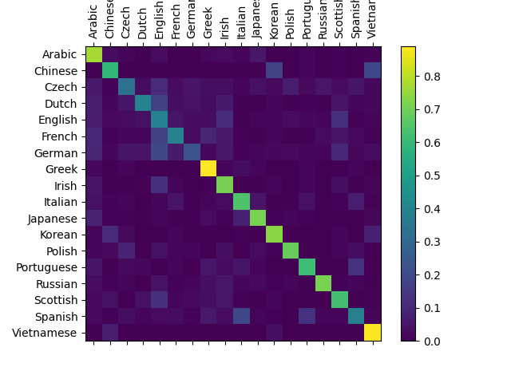
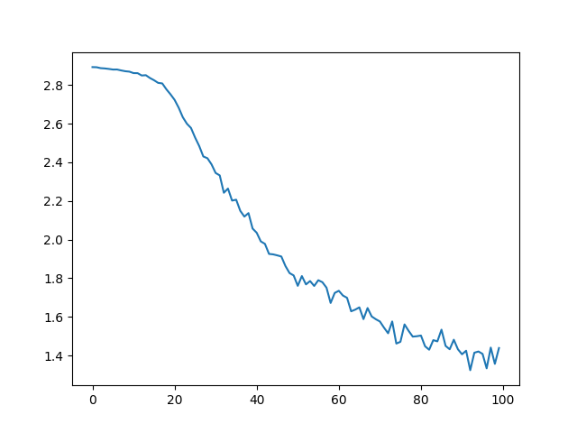
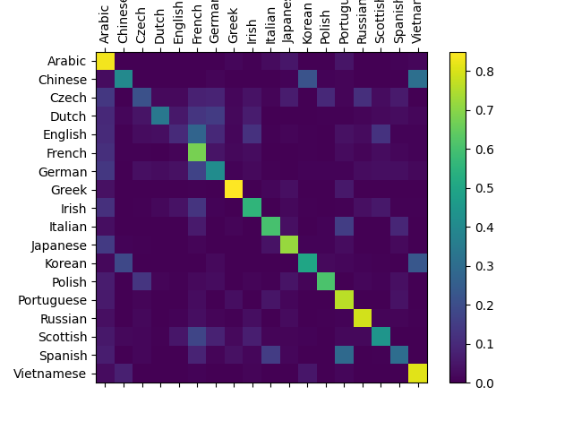
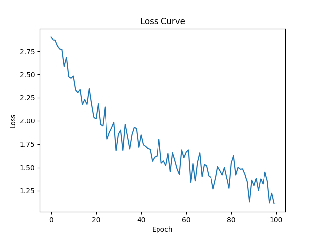
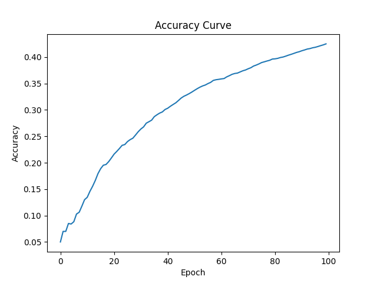
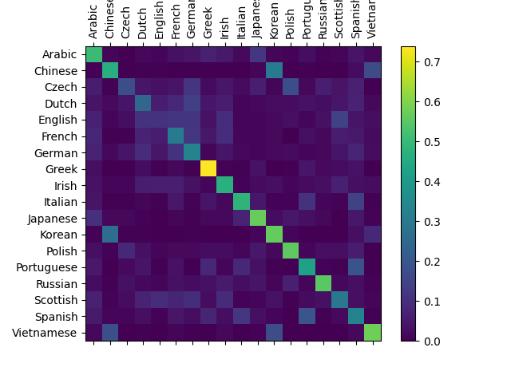

# 循环神经网络实验报告
> 李潇逸    2111454


## 实验要求
* 掌握RNN原理
* 学会使用PyTorch搭建循环神经网络来训练名字识别
* 学会使用PyTorch搭建LSTM网络来训练名字识别


## 实验内容
* 老师提供的原始版本RNN网络结构（可用print(net)打印，复制文字或截图皆可）、在名字识别验证集上的训练loss曲线、准确度曲线图以及预测矩阵图
* 个人实现的LSTM网络结构在上述验证集上的训练loss曲线、准确度曲线图以及预测矩阵图
* 解释为什么LSTM网络的性能优于RNN网络（重点部分）


## 实验过程

### 老师提供
#### RNN
**网络结构**
```sh
RNN(
  (i2h): Linear(in_features=185, out_features=128, bias=True)
  (i2o): Linear(in_features=185, out_features=18, bias=True)
  (softmax): LogSoftmax(dim=1)
)
```
**结果曲线**


#### LSTM
**网络结构**
```sh
LSTM(
  (rnn): LSTM(57, 64)
  (out): Linear(in_features=64, out_features=18, bias=True)
  (softmax): LogSoftmax(dim=-1)
)
```
**结果曲线**


可以发现，LSTM有着更好的结果和更快的学习速度

### 自己实现
本实验中我自己实现了LSTM
#### 代码分析
其他代码与老师所提供的几乎相同，因此这里只展示自己实现的部分。
```py
# 自定义LSTM模型
class LSTM(nn.Module):
    def __init__(self, input_size, hidden_size, output_size):
        super(LSTM, self).__init__()
        self.hidden_size = hidden_size

        # 定义LSTM的四个门的权重和偏置
        self.W_f = nn.Parameter(torch.Tensor(hidden_size, input_size + hidden_size))  # 遗忘门的权重
        self.b_f = nn.Parameter(torch.Tensor(hidden_size))                            # 遗忘门的偏置

        self.W_i = nn.Parameter(torch.Tensor(hidden_size, input_size + hidden_size))  # 输入门的权重
        self.b_i = nn.Parameter(torch.Tensor(hidden_size))                            # 输入门的偏置

        self.W_C = nn.Parameter(torch.Tensor(hidden_size, input_size + hidden_size))  # 候选细胞状态的权重
        self.b_C = nn.Parameter(torch.Tensor(hidden_size))                            # 候选细胞状态的偏置

        self.W_o = nn.Parameter(torch.Tensor(hidden_size, input_size + hidden_size))  # 输出门的权重
        self.b_o = nn.Parameter(torch.Tensor(hidden_size))                            # 输出门的偏置

        # 定义线性层
        self.linear = nn.Linear(hidden_size, output_size)

        # 初始化权重
        self.init_weights()

    def init_weights(self):
        # 仅对权重进行Kaiming初始化
        for name, param in self.named_parameters():
            if 'weight' in name:
                nn.init.kaiming_normal_(param)

    def forward(self, input_seq):
        batch_size = input_seq.size(0)
        seq_length = input_seq.size(1)

        # 初始化隐状态和细胞状态为零
        h_t = torch.zeros(batch_size, self.hidden_size).to(input_seq.device)
        C_t = torch.zeros(batch_size, self.hidden_size).to(input_seq.device)

        for t in range(seq_length):
            x_t = input_seq[:, t, :]
            x_t = x_t.squeeze(1)  # 调整 x_t 的维度使其与 h_t 一致
            combined = torch.cat((x_t, h_t), dim=1)  # 将当前输入和前一时间步的隐状态拼接

            # 计算遗忘门
            f_t = torch.sigmoid(combined @ self.W_f.t() + self.b_f)
            # 计算输入门
            i_t = torch.sigmoid(combined @ self.W_i.t() + self.b_i)
            # 计算候选细胞状态
            C_tilde_t = torch.tanh(combined @ self.W_C.t() + self.b_C)
            # 计算输出门
            o_t = torch.sigmoid(combined @ self.W_o.t() + self.b_o)

            # 更新细胞状态
            C_t = f_t * C_t + i_t * C_tilde_t
            # 更新隐状态
            h_t = o_t * torch.tanh(C_t)

        # 通过线性层生成输出
        output = self.linear(h_t)
        return output
```
1. **LSTM层参数初始化**：定义了遗忘门（`W_f`, `b_f`）、输入门（`W_i`, `b_i`）、候选细胞状态（`W_C`, `b_C`）和输出门（`W_o`, `b_o`）的权重和偏置参数。
2. **`init_weights` 方法**：使用Kaiming初始化方法来初始化参数。
3. **前向传播**：在`forward`方法中，输入序列经过每一个时间步的计算，计算遗忘门、输入门、候选细胞状态和输出门的值，并更新细胞状态和隐状态。
4. **组合输入和隐状态**：在每一个时间步，将当前输入和前一时间步的隐状态组合起来进行计算。
5. **LSTM门计算**：使用线性变换和激活函数（sigmoid和tanh）来计算每一个门的值。
6. **更新细胞状态和隐状态**：使用LSTM公式来更新细胞状态和隐状态。
7. **线性层**：最后通过线性层将隐状态转换为输出。
#### 网络结构
LSTM(
  (linear): Linear(in_features=128, out_features=18, bias=True)
)
只能显示出这样。
#### 结果曲线





## 为什么LSTM网络的性能优于RNN网络

### 1. 梯度消失和梯度爆炸问题
RNN在训练过程中使用反向传播通过时间（BPTT）算法来更新权重。然而，由于RNN的结构，当时间步长较长时，梯度在反向传播过程中可能会快速衰减（梯度消失）或增长（梯度爆炸），这使得网络难以捕捉长期依赖关系。
LSTM通过引入“门控机制”（如遗忘门、输入门和输出门）来控制信息的流动，从而有效地解决了梯度消失和梯度爆炸的问题。具体而言，LSTM使用细胞状态（cell state）来保持长期记忆，并通过门控机制来添加或移除信息。

### 2. 门控机制
LSTM的门控机制包括：
- **遗忘门（Forget Gate）**：决定当前的细胞状态应该丢弃多少过去的信息。
- **输入门（Input Gate）**：决定当前时间步的信息有多少可以更新到细胞状态中。
- **输出门（Output Gate）**：决定细胞状态中的哪些信息可以作为当前时间步的输出。

这些门控机制使LSTM能够选择性地记住或忘记信息，从而更好地捕捉序列中的长期依赖关系。

### 3. 捕捉长期依赖
由于RNN在处理长序列时性能较差，难以捕捉长期依赖关系，而LSTM通过其设计能够有效地保留长期记忆。这使得LSTM在处理需要长时间依赖的任务（如语言建模、时间序列预测和语音识别）时表现得更好。

### 4. 更稳定的训练过程
LSTM的门控机制和细胞状态帮助网络在训练过程中保持更稳定的梯度。这意味着LSTM能够更好地处理长序列，并在训练过程中更快地收敛，减少训练时间。
