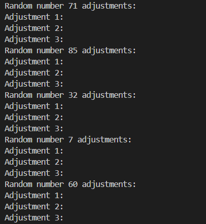
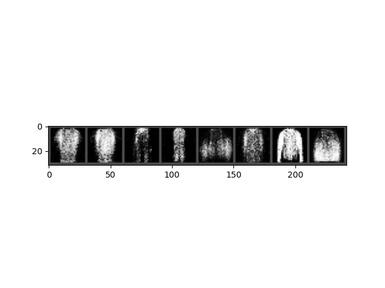
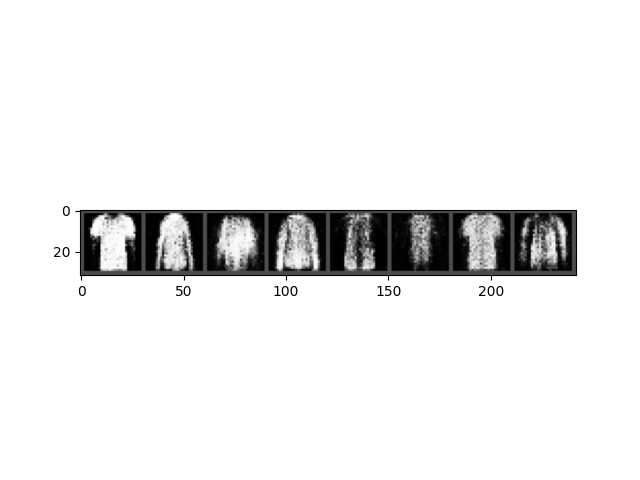

# 生成对抗网络实验报告
> 李潇逸    2111454


## 实验要求
* 掌握GAN原理
* 学会使用PyTorch搭建GAN网络来训练FashionMNIST数据集


## 实验内容
* 老师提供的原始版本GAN网络结构（也可以自由调整网络）在FashionMNIST上的训练loss曲线，生成器和判别器的模型结构（print(G)、print(D)）
* 自定义一组随机数，生成8张图
* 针对自定义的100个随机数，自由挑选5个随机数，查看调整每个随机数时，生成图像的变化（每个随机数调整3次，共生成15x8张图），总结调整每个随机数时，生成图像发生的变化。
* 解释不同随机数调整对生成结果的影响


## 实验过程

### loss 曲线


### 生成器和判别器的模型结构
```sh
Discriminator(
  (fc1): Linear(in_features=784, out_features=128, bias=True)
  (nonlin1): LeakyReLU(negative_slope=0.2)
  (fc2): Linear(in_features=128, out_features=1, bias=True)
)
Generator(
  (fc1): Linear(in_features=100, out_features=128, bias=True)
  (nonlin1): LeakyReLU(negative_slope=0.2)
  (fc2): Linear(in_features=128, out_features=784, bias=True)
)
```

### 随机数选取

单独生成的图片

#### 变化





#### 分析
1. 71：可能导致生成器的输入向量中的某些特征发生变化，因此影响了图像的整体亮度、图案的出现位置或形状等。
2. 85：使某些图片亮度更亮，细节更丰富。
3. 32：使一些图片的纹理发生增加或删除。
4. 7：使一些图片的颜色和位置发生变化
5. 60：使图片的外观发生辩护